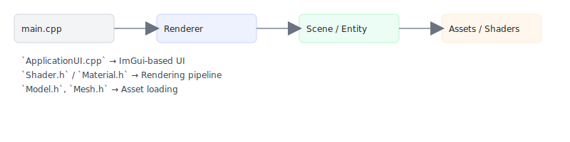
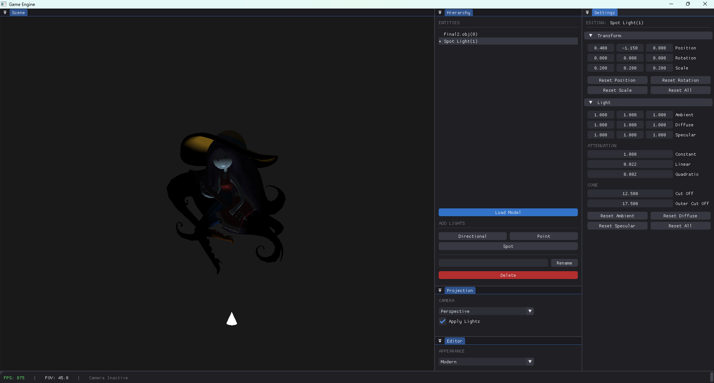
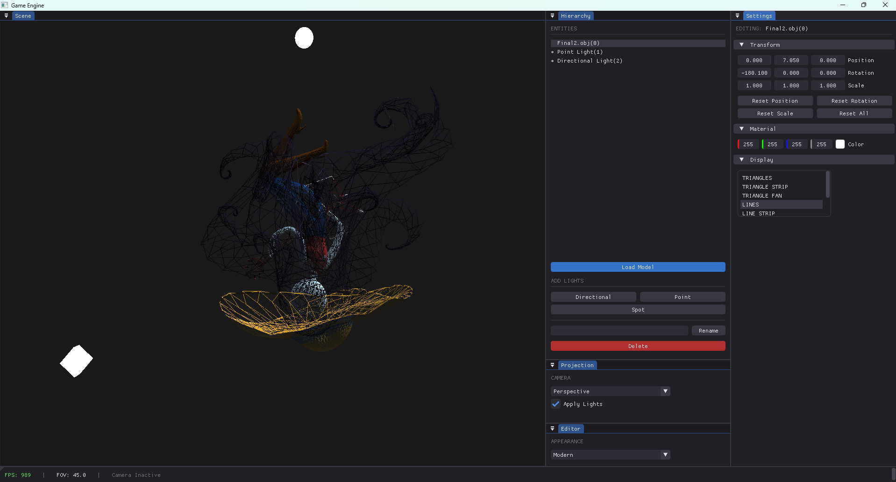

# GameEngine

A small C++ OpenGL-based game engine demo with an immediate-mode UI (ImGui), basic lighting, model loading, and sample assets.

**Quick Intro**
- **What:** Lightweight engine used for experimenting with rendering, materials, and UI.
- **Language:** C++ (Visual Studio on Windows)
- **Renderer:** OpenGL shaders in `GameEngine/assets/shaders`

**Quick Start**
- **Build:** Open [GameEngine/GameEngine.vcxproj](GameEngine/GameEngine.vcxproj) in Visual Studio (x64). Build `Debug` or `Release`.
- **Run:** Executable appears under `GameEngine/x64/Debug/` or `GameEngine/x64/Release/` when built.

**Features**
- Basic PBR-like material support via `GameEngine/Material.h`
- Simple scene graph with `GameEngine/Entity.h` and `GameEngine/Transform.h`
- Shader examples under `GameEngine/assets/shaders/`
- Example primitive models and textures in `GameEngine/assets/`

**Assets**
- Shaders: `GameEngine/assets/shaders/`
- Models & MTL: `GameEngine/assets/shapes/primitives/`
- Textures: `GameEngine/assets/textures/`

**Screenshots — Engine Demos**
- **Scene 1 — Spotlight (cone):** 
  - Demonstrates a spotlight illuminating the scene (visualized as a cone).
- **Scene 2 — Point + Directional (sphere & square):** 
  - Demonstrates a point light (visualized as a sphere) together with a directional light (visualized as a square) and their combined shading effects.

**Contributing**
- Fork the repo, create a branch, and open a PR. Keep changes focused and include screenshots for visual changes.
**License & Contact**
- This repository and all included files are dedicated to the public domain using the **CC0 1.0 Universal** license. You may copy, modify, distribute, and perform the work, even for commercial purposes, all without asking permission.
- See the `LICENSE` file for the full text of the CC0 1.0 Universal dedication.
- For questions or discussion, open an issue.
